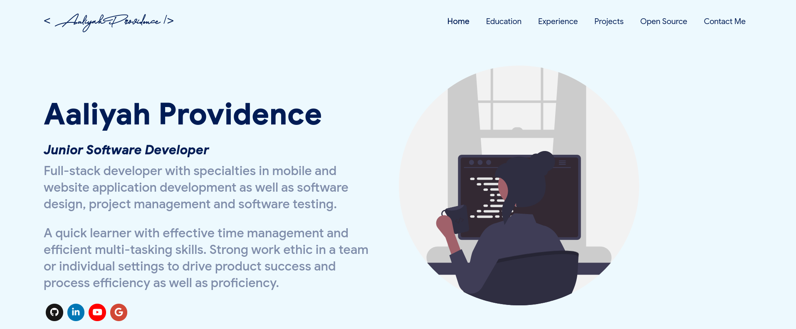

<p style="margin:0 auto; text-align:center;"> 
    </img>
</p>

<h1 style="margin:0 auto; text-align:center;"> Aaliyah Providence's Software Developer Portfolio 🔥 </h1> 
<h3 style="margin:0 auto; text-align:center;  margin-top:20px;"> A showcase of skills, relevant experiences, personal projects and documented source code for coding projects </h3>

<p style="margin:0 auto; margin-top:20px; text-align:center;">
  <a href="https://hits.seeyoufarm.com"></a>
  <a href="https://nodejs.org/en/blog/release/v16.16.0/"></a>
  <a href="https://www.npmjs.com/package/npm/v/8.15.0"></a>
  <a href="https://reactjs.org/"></a>
  <a href="https://github.com/prettier/prettier"></a>
  <br/>
  <a href="https://github.com/Sherida101/Portfolio/commits/main"></a>
  <a href="http://badges.mit-license.org/"></a>
  <a href="/LICENSE"></a>
</p>

<p style="margin:0 auto; margin-top:20px; text-align:center;"> 
    <a href="https://sherida101.github.io/Portfolio" target="_blank">
    </img>
  </a>
</p>

# Sections 📚

✔️ Portfolio Introduction\
✔️ Skills \
✔️ Open Source Projects Connected to Github\
✔️ Experience\
✔️ Qualifications & Certifications 🏆\
✔️ Education\
✔️ Contact Details

To view a live example, **[click here](https://sherida101.github.io/Portfolio)**

# Clone and Use 📋

- The website is built on `react-js` library of `javascript` and as a result, both `nodejs` and `npm` should be installed
- While installing `nodejs` and `npm`, try to install versions which are equal or greater than the versions mentioned in badges above
- In case you want to help developing it or simply saving it, you can fork the repository just by clicking the button on the top-right corner of this page
- After the successful installation of `nodejs` and `npm`, clone the repository into your local system using below command:
  ```bash
   git clone https://github.com/Sherida101/Portfolio.git
  ```
  This will clone the whole repository in your system.
- Navigate to the directory where the cloned repository resides to download the required dependencies to your system. Then, execute the following command:
  ```node
  npm install
  ```
- Load the website locally on a browser with `npm start` now that the project is ready to be used.

# Customise it to make your own portfolio ✏️

In this project, there are basically 4 things that you need to change to customize this to anyone else's portfolio: **package.json**, **Personal Information**, **Github Information** and **Splash Logo**.

### package.json

Open this file, which is in the main cloned directory, choose any "name" and change "homepage " to `https://<your-github-username>.github.io`. Do not forget the `https://`, otherwise fonts will not load.

### Personal Information

You will find `src/portfolio.js` file which contains the complete information about the user. The file looks something like below:

```javascript
// Home Page
const greeting = {
    ...
}

// Social Media
const socialMediaLinks = {
    ...
}

...
```

You can change the personal information, experience, education, social media, certifications, blog information, contact information etc. in `src/portfolio.js` to directly reflect them in portfolio website.

### How to change the icons on homepage under what i do section?

1. This section pulls data from `skills` in portfolio.js file.
2. Visit this website: https://icon-sets.iconify.design/
3. Search for the skill you are looking to add.
4. Select the icon of your choice.
5. Copy the text beside **Selected Icon** and replace it with `fontAwesomeClassName` of that particular softwareSkill.

### Github Information

You will find `git_data_fetcher.mjs` file in the main directory of the repository. This file is used to fetch the data (Pull requests, Issues, Organizations, Pinned projects etc.) from your github.
If you open the file, you will see below component at the top of the file. You need to change only that component.

```javascript
const openSource = {
  githubConvertedToken: "Your Github Token Here.",
  githubUserName: "Your Github Username Here.",
};
```

You can get a github token as described [here](https://docs.github.com/en/github/authenticating-to-github/creating-a-personal-access-token). Give all permissions while generating token. Also add your `githubUserName` in the correct field inside `git_data_fetcher.mjs`.
Now, you need to run following command.

**Warning:** Treat your tokens like passwords and keep them secret. When working with the API, use tokens as environment variables instead of hard-coding them into your programs.

```node
node git_data_fetcher.mjs
```

This will fetch all the data from your github and it will automatically replace my data with yours.
Whenever you want to update the github related information on the website you need to run this command.

### Splash Logo

Note here that if you click [my portfolio](https://sherida101.github.io/Portfolio/), you can see animating the logo at the beginning. I have designed that logo in [`Figma`](https://www.figma.com/) and then animated it using css.
Therefore, this part of portfolio is not customizable. But don't worry we have a solution to this problem. You have below two alternatives:

- If you want to design your own logo, then you can design it using `Figma` or `Adobe XD` or `Adobe Illustrator` or `Inkscape`. If you want to animate it, you can refer to `./src/components/Loader` directory which contains `js` and `css` files which animates the logo
- If you don't want Splash screen or you don't know how to design logo, then this option is for you

  - You can open `src/portfolio.js` file and at the top of this file you will see `settings` component as below:
    ```javascript
    // Website related settings
    const settings = {
      isSplash: true,
    };
    ```
  - Change `isSplash` from `true` to `false`
  - Now, if you see your website using `npm start`, it will directly open `home` rather than animating logo `splash` screen
  - If you design your logo in future, then edit the files in `./src/components/Loader` and then revert `isSplash` to `true` in `src/portfolio.js`.

## Other

- You need to change the website title and other descriptions in `public/index.html`
- You can define your own favicon in `public/icons` directory. If you don't have a favicon, you can generate favicons from [Favicon Generator](https://www.favicon-generator.org/) and [Favicon IO](https://favicon.io/)
- You can also edit your website preview (known as description image). Run your site locally, take a screenshot and replace with `public/icons/desc.png`. Note that your screenshot should be 1280x640 for better preview.

# Choose Theme

- You can take a look at `src/theme.js` file where all available themes are mentioned with their respective color codes
- At the bottom of this file you will see the below code:
  - `export const chosenTheme = blueTheme;`
  - You need to change the name from `blueTheme` to whatever theme you want to set your website to
  - You can define new theme similarly as other themes and you can assign name of that new defined theme to `chosenTheme`
- That's it. You just need to change the theme name and the code will take care of everything else
- Run `npm start` to check if everything is ok.

# Deployment 📦

- Once you are done with your setup and have successfully completed all steps above, you need to put your website online!
- I highly recommend using [Github Pages](https://create-react-app.dev/docs/deployment/#github-pages) to achieve this the EASIEST WAY.
- To deploy your website, create a github repository with the name `<your-github-username>.github.io`. Please don't give it any other name.
- Now, you need to generate a production build and deploy the website.

**Steps**

- Run `npm run build` to generate the production build folder.
- Enter the build folder, `git init` and push the generated code to - the `main` branch formerly known as the `master` branch of the newly created repository.
- `git init` and force push may have to be done at each new build of the website
- You may need to `git init` and force push at every new build.
- In `package.json`, change `homepage` field to `"homepage": "https://myusername.github.io"`,
- Install GitHub pages, `npm install --save gh-pages`
- In `package.json`, add the following scripts where `gh-pages` is the name of branch where the build code will stored:

  "scripts": {

          * "predeploy": "npm run build",
          * "deploy": "gh-pages -b gh-pages -d build",
            "start": "react-scripts start",
            "build": "react-scripts build",
            ....
          }

- Run `npm run deploy` or `npm run deploy -m "Updated a file"` to deploy the project on GitHub pages

# Technologies used 🛠️

- [React](https://reactjs.org/)
- [graphql](https://graphql.org/)
- [apollo-boost](https://www.apollographql.com/docs/react/get-started/)
- [baseui](https://github.com/uber/baseweb)
- [react-reveal](https://www.react-reveal.com/)
- [styled-components](https://styled-components.com/)

# Illustrations 🍥

- [UnDraw](https://undraw.co/illustrations)
- [Iconify design](https://icon-sets.iconify.design)

# License 📄

This project is licensed under the MIT License - see the [LICENSE.md](./LICENSE) file for details.

# Developer ✨

<table>
  <tr>
    <td align="center"><a href="http://Sherida101.github.io"><br /><sub><b>Aaliyah Providence</b></sub></a><br /><a href="https://github.com/Sherida101/Portfolio/commits?author=Sherida101" title="Code">💻</a> <a href="https://github.com/Sherida101/Portfolio/commits?author=Sherida101" title="Documentation">📖</a> <a href="#design-Sherida101" title="Design">🎨</a> <a href="#maintenance-Sherida101" title="Maintenance">🚧</a> <a href="#ideas-Sherida101" title="Ideas, Planning, & Feedback">🤔</a></td>
  </tr>
</table>

# References 👏🏻

- Some design and implementation ideas were adapted from [Ashutosh Hathidara's Master Portfolio Project](https://github.com/ashutosh1919/masterPortfolio)
