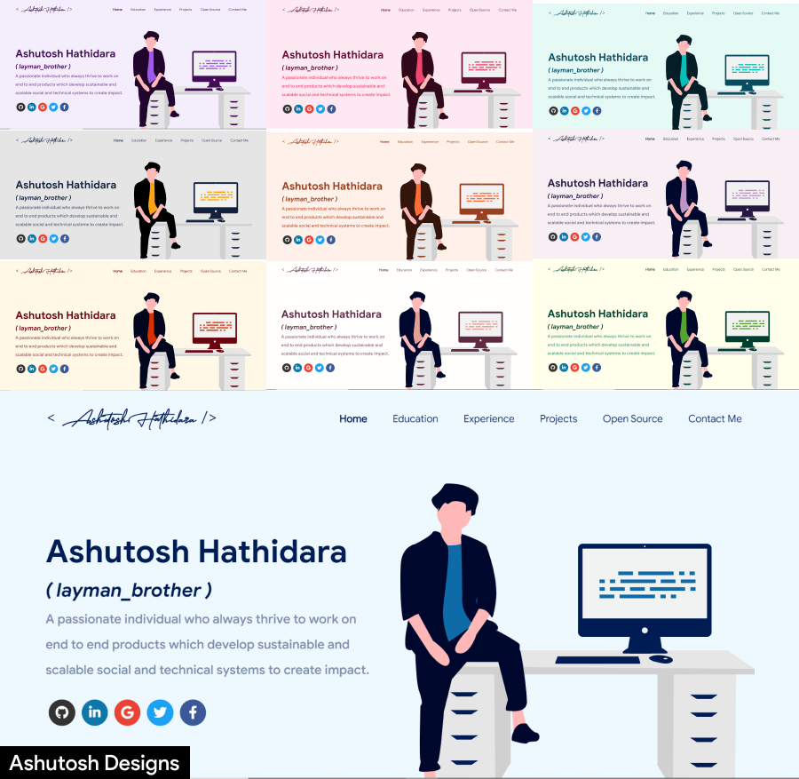

<p align="center"> 
    </img>
</p>

<h1 align="center"> Aaliyah Providence's Software Developer Portfolio 🔥 </h1> 
<h3 align="center"> A showcase of skills, relevant experiences, personal projects and documented source code for coding projects </h3>

<p align="center">
  <a href="http://hits.dwyl.com/Sherida101/PortfolioWebsite"></a>
  <a href="https://nodejs.org/en/blog/release/v16.13.0/"></a>
  <a href="https://www.npmjs.com/package/npm/v/8.1.3"></a>
  <a href="https://reactjs.org/"></a>
  <a href="https://github.com/prettier/prettier"></a>
  <br/>
  <a href="https://travis-ci.org/badges/badgerbadgerbadger"></a>
  <a href="http://badges.mit-license.org/"></a>
  <a href="https://github.com/Sherida101/PortfolioWebsite/commits/master"></a>
  <a href="http://badges.mit-license.org/"></a>
</p>

<p align="center"> 
    <a href="https://Sherida101.github.io" target="_blank">
    </img>
  </a>
</p>

:star: Star me on GitHub — it helps!

# Website Overview 📚

✔️ Portfolio Introduction\
✔️ Skills \
✔️ Open Source Projects Connected with Github\
✔️ Experience\
✔️ Qualifications & Certifications 🏆\
✔️ Education\
✔️ Contact Details

To view a live example, **[click here](https://Sherida101.github.io/)**

# Usage 📋

- The Software Developer portfolio website by Aaliyah Providence is built using `react-js` library of `javascript` and the latest versions of `nodejs` and `npm`.
- After having installed `nodejs` and `npm`, enter the following command to clone the repository to your local system:
  - ```bash
     git clone https://github.com/Sherida101/PortfolioWebsite.git
    ```
- Navigate to the directory where the cloned repository resides to download the required dependencies to your system. Then, execute the following command:
  - ```node
    npm install
    ```
- Load the website locally on a browser with `npm start` now that the project is ready to be used.

# Customize it to make your own portfolio ✏️

In this project, there are basically 4 things that you need to change to customize this to anyone else's portfolio: **package.json**, **Personal Information**, **Github Information** and **Splash Logo**.

### package.json

Open this file, which is in the main cloned directory, choose any "name" and change "homepage " to `https://<your-github-username>.github.io`. Do not forget the `https://`, otherwise fonts will not load.

### Personal Information

You will find `src/portfolio.js` file which contains the complete information about the user. The file looks something like below:

```javascript
// Home Page
const greeting = {
    ...
}

// Social Media
const socialMediaLinks = {
    ...
}

...
```

You can change the personal information, experience, education, social media, certifications, blog information, contact information etc. in `src/portfolio.js` to directly reflect them in portfolio website.

### Github Information

You will find `git_data_fetcher.mjs` file in the main directory of the repository. This file is used to fetch the data (Pull requests, Issues, Organizations, Pinned projects etc.) from your github.
If you open the file, you will see below component at the top of the file. You need to change only that component.

```javascript
const openSource = {
  githubConvertedToken: "Your Github Token Here.",
  githubUserName: "Your Github Username Here.",
};
```

You can get a github token as described [here](https://docs.github.com/en/github/authenticating-to-github/creating-a-personal-access-token). Give all permissions while generating token. Also add your `githubUserName` in the correct field inside `git_data_fetcher.js`.
Now, you need to run following command.

**Warning:** Treat your tokens like passwords and keep them secret. When working with the API, use tokens as environment variables instead of hardcoding them into your programs.

```node
node git_data_fetcher.mjs
```

This will fetch all the data from your github and it will automatically replace my data with yours.
Whenever you want to update the github related information on the website you need to run this command.

### Splash Logo

Note here that if you click [my portfolio](https://Sherida101.github.io/portfolioWebsite), you can see animating the logo at the beginning. I have designed that logo in [`Figma`](https://www.figma.com/) and then animated it using css.
Therefore, this part of portfolio is not customizable. But don't worry we have a solution to this problem. You have below two alternatives:

- If you want to design your own logo, then you can design it using `Figma` or `Adobe XD` or `Adobe Illustrator` or `Inkscape`. If you want to animate it, you can refer to `./src/components/Loader` directory which contains `js` and `css` files which animates the logo.
- If you don't want Splash screen or you don't know how to design logo, then this option is for you.

  - You can open `src/portfolio.js` file and at the top of this file you will see `settings` component as below:
  - ```javascript
    // Website related settings
    const settings = {
      isSplash: true,
    };
    ```
  - Change `isSplash` from `true` to `false`.
  - Now, if you see your website using `npm start`, it will directly open `home` rather than animating logo `splash` screen.
  - If you design your logo in future, then edit the files in `./src/components/Loader` and then revert `isSplash` to `true` in `src/portfolio.js`.

# Choose Theme

- All available themes are found in the `src/theme.js` file with respective color codes.
- At the bottom of this file, the following code is shown:

  - `export const chosenTheme = blueTheme;`
  - The name, `blueTheme`, can be changed to a desired theme name for the website
  - Likewise, a new theme can be similarly defined and the name can be assign named to `chosenTheme`.

  - `npm start` is ran to ensure that everything is okay.

# Deployment 📦

- Once the setup of the website has finished,[Github Pages](https://create-react-app.dev/docs/deployment/#github-pages) is used to deploy the website online.
- After having created a GitHub repository with the name `<your-github-username>.github.io` where `<your-github-username>` is replaced with`Sherida101`, a production build is generated of the website in order for the deployment to be done.

**Steps**

- Run `npm run build` to generate the production build folder.
- Enter the build folder, type `git init`and push the generated code to the `main` branch formerly known as the `master` branch of the newly created repository.
- `git init` and force push may have to be done at each new build of the website

# Technologies used 🛠️

- [React](https://reactjs.org/)
- [graphql](https://graphql.org/)
- [apollo-boost](https://www.apollographql.com/docs/react/get-started/)
- [baseui](https://github.com/uber/baseweb)
- [react-reveal](https://www.react-reveal.com/)
- [styled-components](https://styled-components.com/)

# Illustration 🍥

- [UnDraw](https://undraw.co/illustrations)

# License 📄

This project is licensed under the MIT License - see the [LICENSE.md](./LICENSE) file for details.

# Developer ✨

<!-- DEVELOPER-LIST:START -->
<table>
  <tr>
    <td align="center"><a href="http://Sherida101.github.io"><br /><sub><b>Aaliyah Providence</b></sub></a><br /><a href="https://github.com/Sherida101/PortfolioWebsite/commits?author=Sherida101" title="Code">💻</a> <a href="https://github.com/Sherida101/PortfolioWebsite/commits?author=Sherida101" title="Documentation">📖</a> <a href="#design-Sherida101" title="Design">🎨</a> <a href="#maintenance-Sherida101" title="Maintenance">🚧</a> <a href="#ideas-Sherida101" title="Ideas, Planning, & Feedback">🤔</a></td>
  </tr>
</table>

<!-- ALL-CONTRIBUTORS-LIST:END -->

# References 👏🏻

- Some design and implementation ideas were taken from [Ashutosh Hathidara's Master Portfolio Project](https://github.com/Sherida101/PortfolioWebsite).
